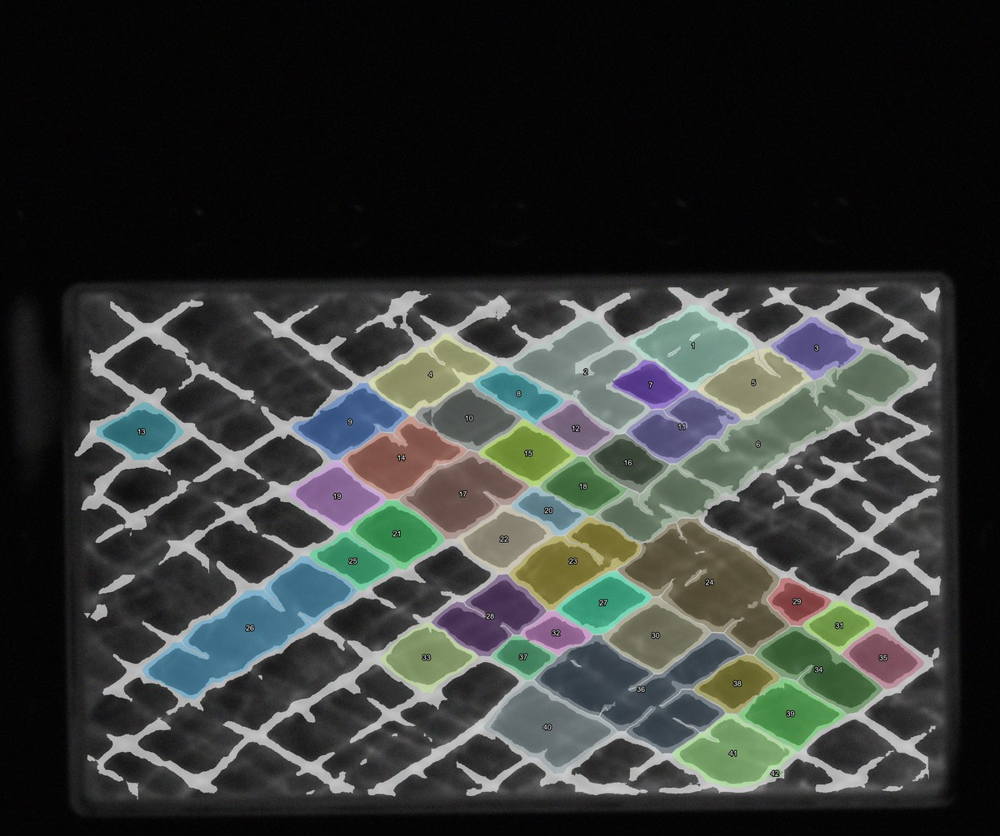
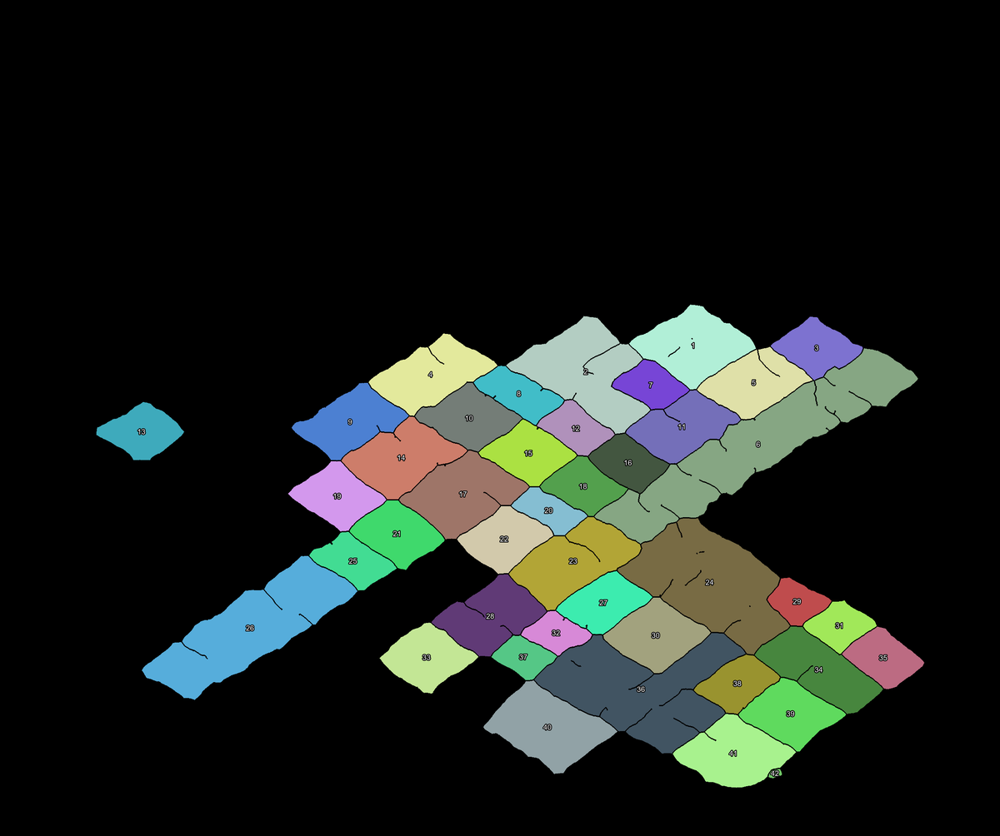
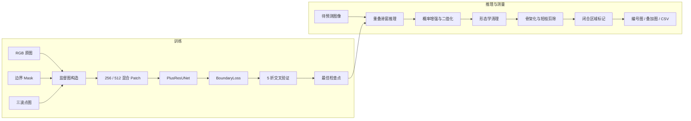

# PlusResUNet：爆轰胞格边界分割与尺寸测量

基于 PyTorch 的端到端图像分析流程：用残差 U-Net 分割爆轰胞格边界，再通过概率增强、形态学清理、骨架化和闭合区域分析，对胞格进行编号并换算真实尺寸。

> `PlusResUNet` 是本项目的内部名称。这里实现的是“U-Net 编解码器 + ResNet 风格残差块”的单输出边界分割网络，并非对某篇同名网络论文的逐层复现，也不同于包含 ASPP、注意力和 SE 模块的 ResUNet++。

## 项目亮点

- 同时使用 `256×256` 与 `512×512` patch，兼顾局部细线和大尺度结构。
- 通过三波点、骨架带和连接区域进行重点采样与空间加权。
- 自定义复合损失：加权 BCE、Focal Tversky、Soft Dice 与胞格内部假阳性惩罚。
- 支持 5 折图像级交叉验证、AdamW 和余弦退火。
- 使用重叠滑窗推理，适配任意尺寸图像。
- 自动输出概率图、二值边界、骨架、结构编号、叠加图及真实尺寸 CSV。
- 仓库附带清理后的最佳检查点、代表性可视化和一份测量结果表。

## 代表性结果

下图来自仓库中保存的一次推理结果。白色区域为预测边界，彩色区域为检测到的闭合胞格，数字为结构 ID。



对应的纯实例编号图：



### 已保存结果的统计

[`results/all_measurements.csv`](results/all_measurements.csv) 包含当前保留的一组测量结果。CSV 中共有 124 个闭合结构，来自 10 个出现有效检测结果的图像文件。

| 指标 | 数值 |
| --- | ---: |
| 闭合结构数 | 124 |
| 有检测结果的图像数 | 10 |
| 平均上下尺寸 | 22.6517 mm |
| 平均左右尺寸 | 34.1455 mm |
| 平均面积 | 453.0908 mm² |
| 面积中位数 | 375.5385 mm² |
| 面积范围 | 7.1854–2142.9138 mm² |

这些数值是对已保存 CSV 的描述性统计，不代表独立测试集性能。物理尺寸直接依赖推理时设置的 `--pixel-per-mm`；改变标定比例会同步改变长度和面积。

### 最佳检查点的验证指标

仓库中的 [`weights/best_model.pt`](weights/best_model.pt) 来自第 5 折的最佳 epoch。检查点记录的验证指标如下：

| 指标 | 数值 |
| --- | ---: |
| Dice | 0.5986 |
| Precision | 0.4705 |
| Recall | 0.8240 |
| Interior FP | 0.1489 |
| 综合 score | 0.5744 |
| Validation loss | 0.7813 |

综合分数定义为：

$$
\text{score}=0.55\,\text{Dice}+0.25\,\text{Precision}
+0.20\,\text{Recall}-0.25\,\text{InteriorFP}.
$$

验证使用随机裁剪 patch，而不是固定的完整图像测试集，因此这些指标主要用于模型选择，不应直接当作严格的最终泛化性能。

## 工作流程



## 仓库结构

```text
plusresunet/
├─ train_plusresunet.py       # 数据处理、模型、损失、验证和训练
├─ predict_plusresunet.py     # 滑窗推理、后处理、编号和尺寸测量
├─ requirements.txt           # Python 依赖
├─ weights/
│  └─ best_model.pt           # 清理本机路径元数据后的最佳检查点
├─ results/
│  └─ all_measurements.csv    # 保留的一组测量汇总
├─ docs/assets/
│  ├─ example_overlay.jpg     # README 代表性叠加结果
│  └─ example_instances.png   # README 代表性实例编号图
├─ __init__.py
└─ README.md
```

原始训练数据、完整推理输出、缓存、重复副本和每折检查点未提交到仓库；它们已由 `.gitignore` 排除。

## 安装

```bash
git clone https://github.com/Che1ry-X/plusresunet.git
cd plusresunet
python -m venv .venv
```

Windows PowerShell：

```powershell
.\.venv\Scripts\Activate.ps1
python -m pip install --upgrade pip
python -m pip install -r requirements.txt
```

Linux / macOS：

```bash
source .venv/bin/activate
python -m pip install --upgrade pip
python -m pip install -r requirements.txt
```

依赖包括 `torch`、`numpy`、`pillow` 和 `scikit-image`。`requirements.txt` 当前未锁定具体版本；如需严格复现实验，建议额外保存 Python、PyTorch、CUDA 和 scikit-image 的版本信息。

## 数据准备

默认数据目录为仓库内的 `data/`：

```text
data/
├─ original/       # 训练 RGB 图像
├─ mask/           # 人工标注的边界二值图
├─ triplepoint/    # 三波点强度图
└─ predict/        # 待预测图像
```

训练时，`original/`、`mask/` 和 `triplepoint/` 中的配对文件必须使用完全相同的文件名。支持扩展名：`.tif`、`.tiff`、`.png`、`.jpg`、`.jpeg`、`.bmp`。

- 原图会转为 RGB。
- `mask` 与 `triplepoint` 会转为灰度图。
- `mask > 127` 被视为真实边界。
- 尺寸不一致时，mask 使用最近邻插值，三波点图使用双线性插值。
- 三波点图仅参与训练加权和重点采样，不是模型输入，推理阶段不需要。
- mask 必须表示“边界线”，而不是胞格内部区域。

## 快速开始

### 训练

```bash
python train_plusresunet.py
```

指定数据、输出目录和训练轮数：

```bash
python train_plusresunet.py \
  --data-dir /path/to/data \
  --out-dir runs \
  --folds 5 \
  --epochs 100
```

仅使用 CPU：

```bash
python train_plusresunet.py --data-dir /path/to/data --cpu
```

训练会生成每折检查点及 `runs/best_model.pt`。最佳模型是综合 score 最高的单折模型，不是 5 折模型集成。

### 推理与尺寸测量

使用仓库附带权重和默认目录：

```bash
python predict_plusresunet.py
```

指定路径与标定比例：

```bash
python predict_plusresunet.py \
  --data-dir /path/to/data \
  --model weights/best_model.pt \
  --out-dir outputs \
  --pixel-per-mm 8.4
```

只处理部分图像：

```bash
python predict_plusresunet.py --image-glob "*.tif" --max-images 10
```

## 实现逻辑

### 1. 监督图构造

训练脚本从硬边界 mask 与三波点图构造七类信息：

| 名称 | 生成方式 | 用途 |
| --- | --- | --- |
| `mask` | `mask > 127` | BCE 与 Focal Tversky 的硬标签 |
| `soft_mask` | 边界及两级膨胀带 | Soft Dice 的软标签 |
| `triple` | 三波点灰度归一化到 `[0,1]` | 空间权重 |
| `line_band` | 边界骨架膨胀 | 空间权重、重点采样 |
| `connection` | `line_band ∩ triple_neighborhood` | 强调三波点附近连接 |
| `triple_neighborhood` | 三波点阈值化后膨胀 | 决定重点采样位置 |
| `interior` | 边界屏障内的闭合区域 | 抑制胞格内部假阳性 |

软边界默认取值为：真实边界 `1.00`、近邻膨胀带 `0.55`、外层膨胀带 `0.25`、其余区域 `0.00`。

### 2. 混合 Patch 采样与增强

每张训练图默认产生 70 个 `256×256` patch 和 30 个 `512×512` patch。以 `focus_prob=0.7` 的概率在边界、三波点邻域或连接区域附近采样，其余情况随机裁剪。

训练增强包括随机水平/垂直翻转、0°/90°/180°/270° 旋转，以及 30% 概率的轻微亮度和对比度扰动。

### 3. PlusResUNet 结构

每个 `ResidualBlock` 包含两个 `3×3 Conv + BatchNorm`。输入输出通道不同时，捷径分支使用 `1×1 Conv`；否则使用恒等映射。

| 阶段 | 默认输出通道 | 相对分辨率 |
| --- | ---: | ---: |
| Encoder 1 | 32 | 1 |
| Encoder 2 | 64 | 1/2 |
| Encoder 3 | 128 | 1/4 |
| Encoder 4 | 256 | 1/8 |
| Bottleneck | 512 | 1/16 |
| Decoder 4 | 256 | 1/8 |
| Decoder 3 | 128 | 1/4 |
| Decoder 2 | 64 | 1/2 |
| Decoder 1 | 32 | 1 |
| Output | 1 | 1 |

下采样使用最大池化，上采样使用转置卷积；解码器与同尺度编码器特征按通道拼接。输出为单通道 logits，Sigmoid 在损失与推理阶段执行。

### 4. 复合 BoundaryLoss

空间权重为：

$$
w=1+\lambda_t\,\text{triple}+\lambda_c\,\text{connection}+\lambda_l\,\text{line\_band}.
$$

默认 `λt=1`、`λc=2`、`λl=1`。BCE 还对正边界像素施加 `1.3×` 权重。总损失为：

$$
L=0.8L_{\mathrm{BCE}}+0.8L_{\mathrm{FocalTversky}}
+0.35L_{\mathrm{SoftDice}}+0.35L_{\mathrm{InteriorFP}}.
$$

- 加权 BCE：保证逐像素二分类稳定训练。
- Focal Tversky：平衡 FP/FN，默认 `α=0.45`、`β=0.55`、`γ=0.75`。
- Soft Dice：允许边界附近存在有限的空间误差。
- Interior FP：直接惩罚真实胞格内部的多余纹理和伪支线。

这四项的组合、空间权重、软标签和 Interior FP 是本项目的定制设计。

### 5. 交叉验证与模型选择

- 按原图做 K 折划分，同一图像的 patch 不会跨训练/验证集合。
- 使用 AdamW 与 CosineAnnealingLR。
- 每折只保留 score 最佳的检查点。
- 所有折结束后，将最佳单折检查点复制为 `best_model.pt`。

### 6. 滑窗推理与后处理

1. 图像补齐到 patch 大小的整数倍。
2. 默认用 `512×512` patch、160 像素重叠滑窗预测。
3. 重叠区域概率取算术平均。
4. 概率增强、可选高斯平滑、迟滞/硬阈值二值化。
5. 闭运算、填小孔、开运算和小对象移除。
6. medial axis 或 skeletonize 骨架化，并剪除连接到分叉点的短枝。
7. 将骨架膨胀为屏障，只保留不接触图像边界的闭合区域。
8. 按真实面积过滤、连通域编号并输出测量结果。

### 7. 尺寸换算

$$
H_{mm}=\frac{H_{px}}{r},\qquad
W_{mm}=\frac{W_{px}}{r},\qquad
A_{mm^2}=\frac{A_{px}}{r^2},
$$

其中 `r = pixel_per_mm`。上下和左右尺寸来自轴对齐外接框，不是旋转最小外接矩形、主轴长度或曲线长度。

## 训练参数

| 参数 | 默认值 | 说明 |
| --- | ---: | --- |
| `--data-dir` | `data` | 数据根目录 |
| `--out-dir` | `runs` | 检查点输出目录 |
| `--folds` | `5` | 图像级交叉验证折数 |
| `--epochs` | `100` | 每折训练轮数 |
| `--batch-size-256` | `6` | 256 patch 的 batch size |
| `--batch-size-512` | `2` | 512 patch 的 batch size |
| `--patches-256-per-image` | `70` | 每图的 256 patch 数 |
| `--patches-512-per-image` | `30` | 每图的 512 patch 数 |
| `--base-channels` | `32` | 第一层基础通道数 |
| `--lr` | `1e-3` | AdamW 初始学习率 |
| `--weight-decay` | `1e-4` | AdamW 权重衰减 |
| `--focus-prob` | `0.7` | 重点区域采样概率 |
| `--soft-radius` | `2` | 软边界膨胀半径 |
| `--line-radius` | `3` | 骨架带膨胀半径 |
| `--triple-near-radius` | `64` | 三波点邻域半径 |
| `--triple-threshold` | `0.2` | 三波点阈值 |
| `--interior-barrier-radius` | `2` | 内部区屏障膨胀半径 |
| `--interior-min-area` | `128` | 内部区最小像素面积 |
| `--bce-loss-weight` | `0.8` | BCE 项系数 |
| `--focal-tversky-loss-weight` | `0.8` | Focal Tversky 项系数 |
| `--soft-dice-loss-weight` | `0.35` | Soft Dice 项系数 |
| `--interior-fp-loss-weight` | `0.35` | Interior FP 项系数 |
| `--positive-weight` | `1.3` | BCE 正边界额外权重 |
| `--triple-point-weight` | `1.0` | 三波点空间权重 |
| `--connection-weight` | `2.0` | 连接区空间权重 |
| `--line-weight` | `1.0` | 骨架带空间权重 |
| `--tversky-alpha` | `0.45` | Tversky FP 权重 |
| `--tversky-beta` | `0.55` | Tversky FN 权重 |
| `--tversky-gamma` | `0.75` | Focal 指数 |
| `--threshold` | `0.5` | 验证二值化高阈值 |
| `--low-threshold` | `0.2` | 写入检查点的低阈值 |
| `--workers` | `0` | DataLoader worker 数 |
| `--seed` | `2026` | Python/NumPy/PyTorch 随机种子 |
| `--cpu` | 关闭 | 强制使用 CPU |

## 推理参数

| 参数 | 默认值 | 说明 |
| --- | ---: | --- |
| `--data-dir` | `data` | 从 `<data-dir>/predict` 读取图像 |
| `--model` | `weights/best_model.pt` | 检查点路径 |
| `--out-dir` | `outputs` | 推理输出目录 |
| `--patch-size` | `512` | 滑窗 patch 大小 |
| `--overlap` | `160` | 相邻 patch 重叠像素 |
| `--threshold` | 检查点值 | 高阈值；检查点默认 0.5 |
| `--low-threshold` | 检查点值 | 迟滞低阈值；检查点默认 0.2 |
| `--white-boost` | `1.05` | 概率增强指数 |
| `--smooth-sigma` | `0.4` | 高斯平滑 sigma |
| `--binarize-mode` | `hysteresis` | `hysteresis` 或 `hard` |
| `--min-line-area` | `24` | 最小边界对象像素数 |
| `--pre-skeleton-close-radius` | `2` | 骨架化前闭运算半径 |
| `--pre-skeleton-open-radius` | `1` | 骨架化前开运算半径 |
| `--pre-skeleton-hole-area` | `96` | 填充的小孔面积阈值 |
| `--skeleton-method` | `medial` | `medial` 或 `skeletonize` |
| `--medial-min-distance` | `1.5` | medial axis 最小距离 |
| `--spur-prune-length` | `28` | 最大短枝长度 |
| `--spur-prune-iterations` | `4` | 短枝剪除迭代次数 |
| `--barrier-radius` | `1` | 骨架屏障膨胀半径 |
| `--min-area-mm2` | `5.0` | 闭合结构最小真实面积 |
| `--pixel-per-mm` | `8.4` | 像素/毫米标定比例 |
| `--image-glob` | 空 | 文件名筛选模式 |
| `--max-images` | `0` | 最大图像数；0 表示不限 |
| `--cpu` | 关闭 | 强制使用 CPU |

## 输出说明

| 目录/文件 | 内容 |
| --- | --- |
| `binary_mask/` | 阈值化后的边界二值图 |
| `probability/` | 网络原始概率图 |
| `probability_boosted/` | 增强和平滑后的概率图 |
| `cleaned_mask/` | 形态学清理后的边界图 |
| `skeleton_raw/` | 剪枝前骨架 |
| `skeleton_1px/` | 剪枝后单像素骨架 |
| `structure_id/` | `uint16` 闭合结构编号 TIFF |
| `colored_mask/` | 随机着色并标注 ID 的结构图 |
| `overlay/` | 原图、边界、结构颜色与 ID 的叠加图 |
| `measurements/` | 每张图的结构测量 CSV |
| `all_measurements.csv` | 所有有效结构的汇总 CSV |

测量字段包括 `id`、`top_to_bottom_mm`、`left_to_right_mm`、`height_width_ratio` 和 `area_mm2`；汇总 CSV 额外包含 `image`。

## 已知限制

- 验证集使用随机 patch；每个 epoch 的验证裁剪位置可能不同。
- 当前发布结果没有独立测试集标签，因此没有报告独立测试集 Dice/Precision/Recall。
- 闭合结构数量对阈值、闭运算、短枝剪除和屏障半径较敏感。
- 图像边界上的开放结构会被 `clear_border` 移除。
- 真实尺寸完全依赖正确的 `pixel_per_mm` 标定。
- 全部训练图像和完整中间输出未包含在仓库中。
- `uint16` 编号图最多无歧义表示 65535 个标签。

## 参考资料

1. Ronneberger, O., Fischer, P., & Brox, T. [U-Net: Convolutional Networks for Biomedical Image Segmentation](https://arxiv.org/abs/1505.04597).
2. He, K., Zhang, X., Ren, S., & Sun, J. [Deep Residual Learning for Image Recognition](https://arxiv.org/abs/1512.03385).
3. Milletari, F., Navab, N., & Ahmadi, S.-A. [V-Net: Fully Convolutional Neural Networks for Volumetric Medical Image Segmentation](https://arxiv.org/abs/1606.04797).
4. Salehi, S. S. M., Erdogmus, D., & Gholipour, A. [Tversky loss function for image segmentation using 3D fully convolutional deep networks](https://arxiv.org/abs/1706.05721).
5. Abraham, N., & Khan, N. M. [A Novel Focal Tversky Loss Function with Improved Attention U-Net for Lesion Segmentation](https://arxiv.org/abs/1810.07842).
6. PyTorch. [BCEWithLogitsLoss documentation](https://docs.pytorch.org/docs/stable/generated/torch.nn.BCEWithLogitsLoss.html).

## 致谢与说明

本仓库用于研究与工程复现。若用于论文、报告或生产流程，请重新核对数据许可、标定方法、独立测试集表现和运行环境。仓库目前未附加开源许可证；在许可证明确前，默认保留全部权利。
