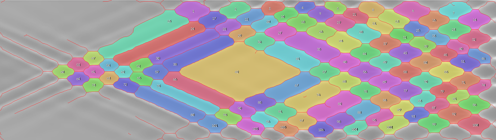
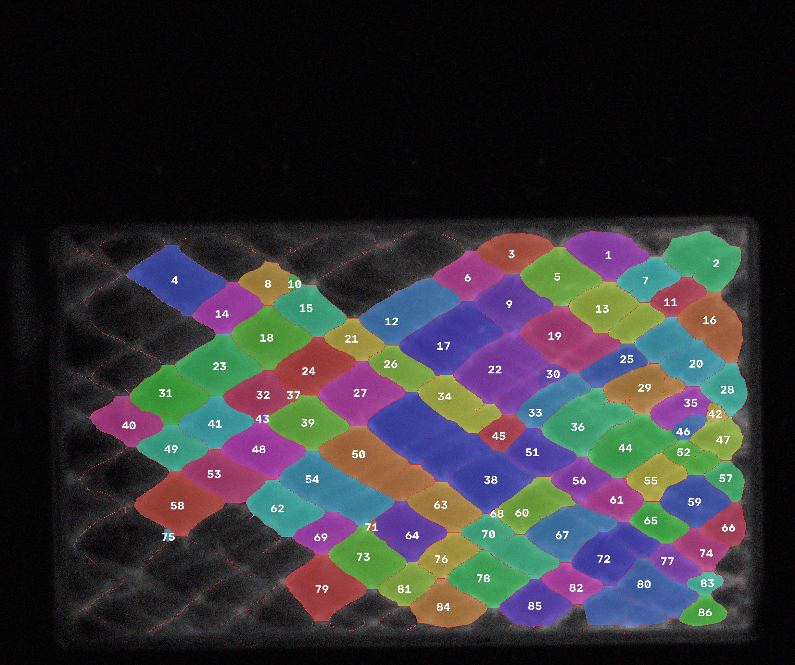

# 爆轰三波点轨迹线：ResUNet + clDice（全512训练版）

这是原 PlusResUNet 项目的拓扑约束更新版。网络仍采用残差 U-Net，但训练目标引入
**centerline Dice（clDice）**，使模型在关注像素重叠的同时，更直接地约束细轨迹线的连通性和胞格拓扑。

当前训练配置已经取消1024图块，训练和验证全部使用512×512图块，
默认 batch-size=2，以降低显存压力。

## 本次更新与原版对比

| 项目 | 原 PlusResUNet | 当前 ResUNet + clDice |
| --- | --- | --- |
| 输入 | RGB 三通道 | 归一化灰度单通道 |
| 主监督信号 | 边界 mask + 三波点图 | 轨迹线 mask，不再要求三波点图 |
| 损失函数 | 加权 BCE + Focal Tversky + Soft Dice + 胞格内部假阳性惩罚 | `0.3 BCE + 0.3 Dice + 0.4 clDice` |
| 拓扑约束 | 间接由空间权重和内部惩罚提供 | 通过可微骨架化和 clDice 直接约束连通性 |
| Patch | 256×256 与 512×512 混合 | 统一 512×512 |
| 抽样 | 不同尺度分别按图采样 | 每张图获得近乎相同的样本数，70% 前景引导 |
| 验证 | 5 折图像级交叉验证 | 默认 80/20 图像级固定划分 |
| 最佳模型 | 综合 score 最高的单折模型 | 验证 Dice 最高的 `best.pt` |
| 评估 | Dice、Precision、Recall、Interior FP | 新增 clDice、IoU、Specificity、Balanced Accuracy 等逐图指标 |
| 几何输出 | 高、宽、面积 | 高、宽、面积，并新增周长 |
| 代码结构 | 训练/预测两个大脚本 | 拆分为数据、模型、损失、指标、后处理、训练和预测模块 |

原版代码、权重和结果仍保留在 Git 历史的 `5489b56` 提交中，可用于完整回溯和对比。

## 主要功能

1. ResUNet残差分割网络；
2. 损失函数为0.3 BCE + 0.3 Dice + 0.4 clDice；
3. 所有训练图块固定为512×512；
4. 每张训练图的采样次数均衡，最大相差不超过1次；
5. 训练时默认batch-size=2；
6. 预测输出概率图、二值图、1 px骨架和闭合结构彩色图；
7. 统计闭合结构上下距离、左右距离、面积和周长；
8. 提供真值mask时，逐图输出Dice、clDice、Recall等指标。

## 目录约定

远程主机建议保持以下结构：

~~~text
$HOME/CR/
├── plusresunet/
└── train/
    ├── original/
    ├── mask/
    └── predict/
~~~

本版本结果固定分类保存为：

~~~text
$HOME/CR/plusresunet/runs/resunet_cl/
$HOME/CR/plusresunet/predict_results_resunet_cl/
~~~

## 运行环境

目标环境：

~~~text
Python       3.7.16
PyTorch      1.2.0
CUDA         10.0
Pillow       9.4.0
scikit-image 0.19.3
SciPy        1.7.3
~~~

代码使用FP32，不使用AMP，也不使用新版DataLoader参数。不要重新安装
PyTorch，以免破坏现有CUDA环境。

安装其余依赖：

~~~bash
git clone https://github.com/Che1ry-X/plusresunet.git
cd plusresunet
conda activate SKESEG
pip install -r requirements.txt
~~~

## 快速测试

正式训练前先运行：

~~~bash
conda activate SKESEG
cd $HOME/CR/plusresunet
python quick_test.py
~~~

快速测试检查：

- 每张图均衡采样；
- 单一固定图块尺寸；
- batch-size=2的张量堆叠；
- 0.3 BCE + 0.3 Dice + 0.4 clDice前向和反向传播；
- 滑窗预测；
- Dice、clDice、Recall计算；
- 1 px骨架化、反向填充和测量输出。

## 数据划分和每轮采样

当前数据大约有72张图。使用：

~~~text
validation_fraction = 0.2
~~~

如果实际正好是72张，通常划分为：

~~~text
训练图：58张
验证图：14张
~~~

默认每个epoch生成580个训练块，全部是512×512：

~~~text
580 ÷ 58 = 每张训练图10块
batch-size=2
每个epoch约290次参数更新
~~~

如果实际训练图数量发生变化，均衡采样器仍会保证每张图的训练块数量
最多只相差1次，并且每个新epoch会重新生成裁剪位置和额外样本分配。

每个训练块的裁剪策略：

- 70%概率在mask前景轨迹线附近裁剪；
- 30%概率在整张图内随机裁剪；
- 随机水平翻转和垂直翻转；
- 随机旋转0°、90°、180°或270°；
- 随机亮度和对比度变化；
- 25%概率加入少量高斯噪声。

这里的70%表示前景引导裁剪概率，不再表示不同图块尺寸的比例。

## 损失函数

损失按照要求原样计算：

~~~text
total_loss =
    0.3 × BCE
  + 0.3 × DiceLoss
  + 0.4 × clDiceLoss
~~~

三个权重相加为1.0，程序直接使用这组权重。clDice默认执行10次可微骨架迭代：

~~~text
cldice_iterations = 10
~~~

### 为什么引入 clDice

常规 Dice 主要衡量区域重叠，一条很细的轨迹线即使在局部断裂，像素级分数也可能只发生较小变化；但对爆轰胞格而言，这种断裂会直接改变闭合结构数量和尺寸测量。

clDice 由 **Suprosanna Shit、Johannes C. Paetzold 等人**提出，同时比较“预测骨架是否落在真值内”和“真值骨架是否被预测覆盖”：

$$
T_{prec}=\frac{|S(P)\cap V_L|}{|S(P)|},\qquad
T_{sens}=\frac{|S(L)\cap V_P|}{|S(L)|},
$$

$$
clDice=\frac{2T_{prec}T_{sens}}{T_{prec}+T_{sens}}.
$$

其中 $P$ 和 $L$ 分别为预测与标签，$S(\cdot)$ 表示骨架化，$V$ 表示二值区域。训练阶段使用可微的 soft skeletonization，从而将连通性信息反向传播到网络。本实现默认进行 10 次 soft-skeleton 迭代，并给 clDice 分配最高的 0.4 损失权重。

方法来源及完整作者信息见文末[参考文献](#参考文献)。

history.csv记录：

~~~text
train_loss / val_loss
train_bce_loss / val_bce_loss
train_dice_loss / val_dice_loss
train_cldice_loss / val_cldice_loss
train_soft_cldice / val_soft_cldice
train_dice / val_dice
train_iou / val_iou
train_precision / val_precision
train_recall / val_recall
learning_rate
~~~

## 训练命令

~~~bash
conda activate SKESEG
cd $HOME/CR/plusresunet

CUDA_VISIBLE_DEVICES=0 python -u train.py \
  --data-root $HOME/CR/train \
  --output-dir $HOME/CR/plusresunet/runs/resunet_cl \
  --device cuda \
  --epochs 100 \
  --batch-size 2 \
  --patch-size 512 \
  --samples-per-epoch 580 \
  --validation-samples 128 \
  --validation-fraction 0.2 \
  --foreground-probability 0.7 \
  --base-channels 32 \
  --learning-rate 0.001 \
  --weight-decay 0.0001 \
  --bce-weight 0.3 \
  --dice-weight 0.3 \
  --cldice-weight 0.4 \
  --cldice-iterations 10 \
  --threshold 0.2 \
  --num-workers 2 \
  --patience 20 \
  --seed 42
~~~

只允许使用物理GPU 0，因此命令必须保留：

~~~text
CUDA_VISIBLE_DEVICES=0
~~~

训练输出：

~~~text
best.pt
last.pt
history.csv
split.json
config.json
sampling_plan_epoch_001.json
~~~

sampling_plan_epoch_001.json记录第一轮每张训练图获得的512训练块数量，
可以用来核对是否均衡。

### 当前最佳模型保存依据

best.pt目前依据验证集整体Dice保存：

~~~text
prediction = sigmoid(logits) >= 0.2
val_dice = 2TP / (predicted_positive + actual_positive)
~~~

当本轮val_dice严格高于历史最佳值时覆盖best.pt。soft-clDice会写入日志和
checkpoint，但目前不决定best.pt。学习率调度和早停也监控val_dice。

## 无真值的真实预测

predict目录通常没有对应mask，因此Dice、clDice和Recall无法计算。程序仍然
输出完整预测、闭合结构和几何结果，监督指标记录为NaN。

~~~bash
conda activate SKESEG
cd $HOME/CR/plusresunet

CUDA_VISIBLE_DEVICES=0 python -u predict.py \
  --checkpoint $HOME/CR/plusresunet/runs/resunet_cl/best.pt \
  --data-root $HOME/CR/train \
  --input-dir $HOME/CR/train/predict \
  --output-dir $HOME/CR/plusresunet/predict_results_resunet_cl \
  --device cuda \
  --tile-size 512 \
  --overlap 128 \
  --batch-size 2 \
  --threshold 0.2 \
  --pixels-per-mm 8.4
~~~

## 带真值的逐图评估

Dice、clDice、Recall等监督指标必须提供与输入图同名、空间对齐的mask。
可以先在已有原图和mask上评估：

~~~bash
CUDA_VISIBLE_DEVICES=0 python -u predict.py \
  --checkpoint $HOME/CR/plusresunet/runs/resunet_cl/best.pt \
  --data-root $HOME/CR/train \
  --input-dir $HOME/CR/train/original \
  --ground-truth-dir $HOME/CR/train/mask \
  --output-dir $HOME/CR/plusresunet/predict_results_resunet_cl_eval \
  --device cuda \
  --tile-size 512 \
  --overlap 128 \
  --batch-size 2 \
  --threshold 0.2 \
  --pixels-per-mm 8.4
~~~

逐图指标分为两组：

~~~text
raw_*       阈值二值化后、后处理前
cleaned_*   去小连通域和闭运算后
~~~

主要指标：

~~~text
dice
cldice
iou
precision
recall
specificity
accuracy
balanced_accuracy
true_positive_px
false_positive_px
false_negative_px
true_negative_px
~~~

每张图保存metrics.csv，总目录保存：

~~~text
all_metrics.csv
all_metrics.xlsx
all_summary.csv
all_measurements.csv
all_measurements.xlsx
~~~

## 每张图的预测输出

~~~text
probability_uint16.tif
binary_mask.tif
cleaned_mask.tif
skeleton_1px.tif
closed_structure_ids.tif
closed_structures_color.png
closed_structures_overlay.png
measurements.csv
summary.csv
metrics.csv
~~~

后处理默认参数：

~~~text
threshold             = 0.2
pixels_per_mm         = 8.4
closing_kernel        = 3
min_line_component_px = 20
min_closed_area_px    = 50
~~~

尺度换算：

~~~text
top_to_bottom_mm = top_to_bottom_px / 8.4
left_to_right_mm = left_to_right_px / 8.4
area_mm2         = area_px2 / (8.4²)
perimeter_mm     = perimeter_px / 8.4
~~~

## 可视化结果

仓库附带两组完整推理输出，不只包含展示用 PNG，也保留了概率图、二值图、清理结果、1 px 骨架、结构 ID 图和 CSV 测量表。

### `1-negative`

该样例检出 106 个闭合结构。

- [完整结果目录](examples/1-negative)
- [彩色结构图](examples/1-negative/closed_structures_color.png)
- [结构测量表](examples/1-negative/measurements.csv)

### `64`

该样例检出 86 个闭合结构。原始文件名为 `64-C2H2-2.5O2-65%Ar-7.50kPa-1_gamma0p6_CLAHEclip01_GBlur05_GNoise10.tif`。

- [完整结果目录](examples/64)
- [彩色结构图](examples/64/closed_structures_color.png)
- [结构测量表](examples/64/measurements.csv)

这两组数据没有提供空间对齐的真值 mask，因此 `metrics.csv` 中的 Dice、clDice 和 Recall 等监督指标为空值；不应将空值解读为 0 分。

## 注意事项

当前已知1.tif原图和mask尺寸不一致。程序会使用最近邻插值把mask调整到
原图尺寸，但这不能保证标注在空间上真正对齐。细轨迹线对错位非常敏感，
正式比较模型前建议人工复查该标注。

## 参考文献

1. Suprosanna Shit, Johannes C. Paetzold, Anjany Sekuboyina, Ivan Ezhov, Alexander Unger, Andrey Zhylka, Josien P. W. Pluim, Ulrich Bauer, and Bjoern H. Menze. [*clDice - A Novel Topology-Preserving Loss Function for Tubular Structure Segmentation*](https://openaccess.thecvf.com/content/CVPR2021/html/Shit_clDice_-_A_Novel_Topology-Preserving_Loss_Function_for_Tubular_Structure_CVPR_2021_paper.html). CVPR, 2021, pp. 16560–16569. DOI: [10.1109/CVPR46437.2021.01629](https://doi.org/10.1109/CVPR46437.2021.01629).
2. Olaf Ronneberger, Philipp Fischer, and Thomas Brox. [*U-Net: Convolutional Networks for Biomedical Image Segmentation*](https://arxiv.org/abs/1505.04597). MICCAI, 2015.
3. Kaiming He, Xiangyu Zhang, Shaoqing Ren, and Jian Sun. [*Deep Residual Learning for Image Recognition*](https://arxiv.org/abs/1512.03385). CVPR, 2016.

